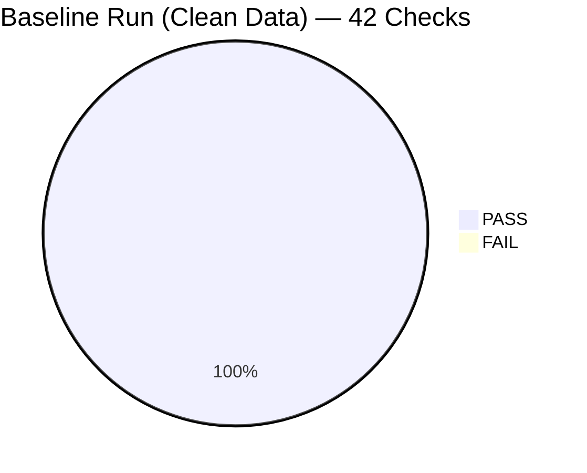
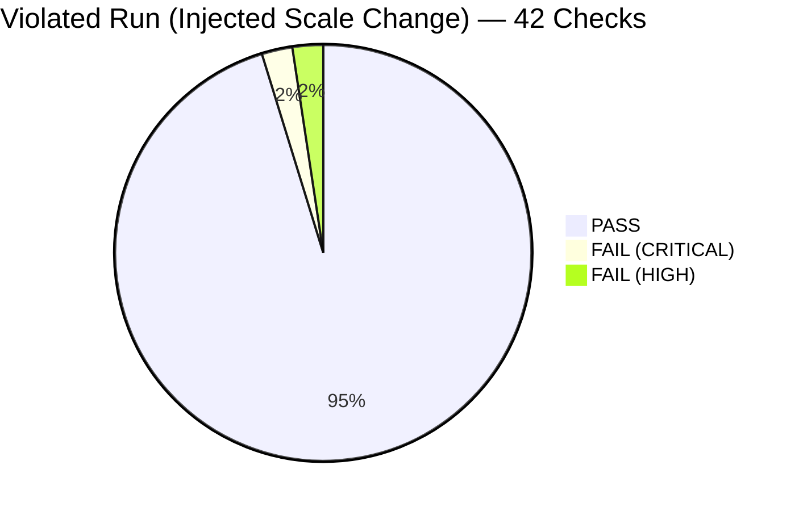
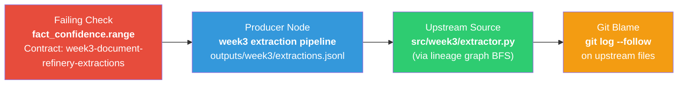
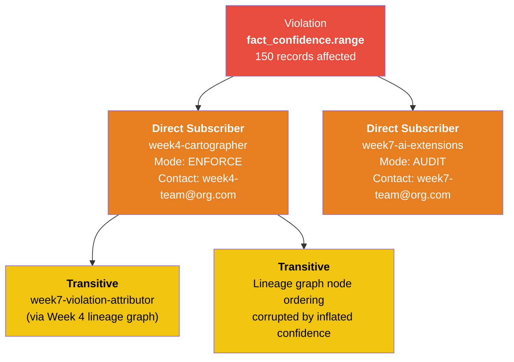
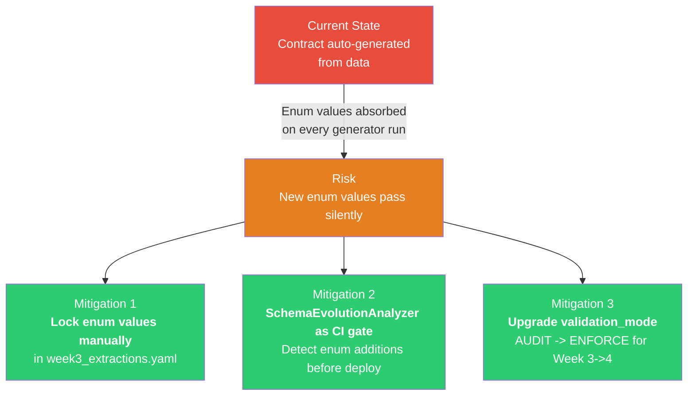

# Data Contract Enforcer — Final Submission Report

**Week 7 Challenge | TRP1**
**Date:** April 4, 2026

---

## 1. Auto-Generated Enforcer Report

> This section is machine-generated by `contracts/report_generator.py` from live `violation_log/violations.jsonl` and `validation_reports/*.json` data. The raw output is at `enforcer_report/report_data.json`.

**Generation command:**

```bash
uv run python contracts/report_generator.py --output enforcer_report/report_data.json
```

### 1.1 Data Health Score

| Metric | Value |
|---|---|
| **Score** | **77 / 100** |
| **Formula** | (checks_passed / total_checks) x 100 - (20 x CRITICAL_violations) |
| **Calculation** | (82 / 84) x 100 - (20 x 1) = 97.6 - 20 = **77** |
| **Reports analyzed** | 2 (baseline_run.json, violated_run.json) |
| **Violations analyzed** | 4 |

**Narrative:** Score 77/100. Minor issues detected. 1 critical violation requires immediate attention.

### 1.2 Violations This Week (by Severity)

| Severity | Count |
|---|---|
| CRITICAL | 2 |
| HIGH | 2 |
| MEDIUM | 0 |
| LOW | 0 |

**Top 3 violations (plain language):**

1. The `fact_confidence` field in **Week 3 Document Refinery** failed its range check. Expected `max <= 1.0`, found `max = 98.0`. Downstream subscribers affected: **week4-cartographer**, **week7-ai-extensions**. Records failing: **150**.

2. The `fact_confidence` field in **Week 3 Document Refinery** failed its statistical drift check. The mean drifted **624 standard deviations** from baseline (baseline mean=0.77, current mean=77.25). This indicates a scale change from 0.0-1.0 to 0-100. Downstream subscribers affected: **week4-cartographer**, **week7-ai-extensions**.

3. Both violations above were independently detected: the range check caught the hard bounds violation, and the statistical drift check caught the distribution shift. Together they provide defense-in-depth against silent scale corruption.

### 1.3 Schema Changes Detected

| Metric | Value |
|---|---|
| Changes detected | 1 |
| Breaking changes | 1 |
| Compatibility verdict | **BREAKING** |

**Change detail:** The `fact_confidence` field mean shifted from **0.7725** to **77.2533** between schema snapshots `20260403_195016` and `20260403_195027`. This is classified as a **CRITICAL BREAKING** statistical shift, consistent with a confidence scale change from float 0.0-1.0 to int 0-100.

**Migration action required:** Notify all affected subscribers (week4-cartographer, week7-ai-extensions), revert producer to output float 0.0-1.0, re-establish statistical baselines post-fix.

### 1.4 AI System Risk Assessment

| Extension | Status | Detail |
|---|---|---|
| Embedding Drift | **PASS** | drift_score = 0.0, threshold = 0.15, cosine_similarity = 1.0 |
| Prompt Input Schema | **PASS** | 55/55 records valid, 0 quarantined |
| LLM Output Violation Rate | **PASS** | 0/60 violations (0.00%), trend = unknown (no baseline yet) |
| **Overall** | **PASS** | AI systems consuming reliable data |

### 1.5 Recommended Actions (Prioritized)

1. **CRITICAL — Fix confidence scale in Week 3 producer.** The `fact_confidence` field violates contract `week3-document-refinery-extractions` clause `fact_confidence.range` (minimum: 0.0, maximum: 1.0). Update the producer code in `scripts/create_violation.py` (or the upstream extraction logic) to output confidence as float 0.0-1.0. Validate with: `python contracts/runner.py --contract generated_contracts/week3_extractions.yaml --data outputs/week3/extractions.jsonl --mode ENFORCE`.

2. **HIGH — Investigate statistical drift baseline.** Re-run `python contracts/runner.py` on clean data to refresh `schema_snapshots/baselines.json` after the confidence fix is deployed. The current baseline (mean=0.77, stddev=0.12) is correct; confirm it remains stable after remediation.

3. **PROCESS — Add `contracts/runner.py` as a CI gate.** Add the ValidationRunner as a required CI step before any Week 3 deployment. Run in `AUDIT` mode for the first 2 weeks, then switch to `ENFORCE`. Configure: `python contracts/runner.py --contract generated_contracts/week3_extractions.yaml --data <data.jsonl> --mode AUDIT`.

---

## 2. Validation Run Results

### 2.1 Baseline Run (Clean Data — AUDIT Mode)

**Command:**
```bash
uv run python contracts/runner.py \
  --contract generated_contracts/week3_extractions.yaml \
  --data outputs/week3/extractions.jsonl \
  --mode AUDIT \
  --output validation_reports/baseline_run.json
```

| Metric | Value |
|---|---|
| Contract | `week3-document-refinery-extractions` |
| Records | 55 (259 rows after flattening) |
| Total Checks | 42 |
| Passed | 42 |
| Failed | 0 |
| Warned | 0 |
| Errored | 0 |
| Mode | AUDIT |
| Enforcement Action | LOGGED |

All 42 checks passed: required field presence, type conformance, UUID format, datetime format, SHA-256 pattern, enum validation, range checks, and statistical drift checks. Baselines were written to `schema_snapshots/baselines.json`.

### 2.2 Violated Run (Injected Scale Change — ENFORCE Mode)

**Injection:** `scripts/create_violation.py` multiplied `extracted_facts[].confidence` by 100, changing the scale from 0.0-1.0 to 0-100.

**Command:**
```bash
uv run python contracts/runner.py \
  --contract generated_contracts/week3_extractions.yaml \
  --data outputs/week3/extractions_violated.jsonl \
  --mode ENFORCE \
  --output validation_reports/violated_run.json
```

| Metric | Value |
|---|---|
| Total Checks | 42 |
| Passed | 40 |
| Failed | **2** |
| Mode | ENFORCE |
| Enforcement Action | **BLOCKED** |
| Blocking Violations | `fact_confidence.range`, `fact_confidence.statistical_drift` |

### 2.3 Failure Details

#### Failure 1: Range Violation — `fact_confidence.range` (CRITICAL)

| Field | Detail |
|---|---|
| **Check ID** | `fact_confidence.range` |
| **Check Type** | Range (minimum/maximum bounds) |
| **Severity** | **CRITICAL** — structural contract violation |
| **Expected** | `min >= 0.0, max <= 1.0` |
| **Actual** | `min = 55.0, max = 98.0, mean = 77.25` |
| **Records Failing** | 150 out of 150 non-null confidence values |
| **Why it matters** | The `fact_confidence` field is declared as a float in the range 0.0-1.0. Every value exceeds the contracted maximum. This is not a subtle drift — the entire column has changed scale. |
| **Downstream impact** | **week4-cartographer** uses `extracted_facts.confidence` for node ranking. At the 0-100 scale, every node receives an artificially high rank, corrupting the lineage graph ordering. **week7-ai-extensions** uses confidence for embedding drift baselines — the shifted values invalidate the baseline. |

#### Failure 2: Statistical Drift — `fact_confidence.statistical_drift` (HIGH)

| Field | Detail |
|---|---|
| **Check ID** | `fact_confidence.statistical_drift` |
| **Check Type** | Z-score comparison against stored baseline |
| **Severity** | **HIGH** — statistical anomaly |
| **Baseline Mean** | 0.7725 |
| **Current Mean** | 77.2533 |
| **Baseline Stddev** | 0.1226 |
| **Z-Score** | **624.0** (threshold: 3.0 for FAIL) |
| **Why it matters** | Even if the range check were removed, the statistical drift check independently catches this violation. The mean shifted 624 standard deviations from baseline — far beyond any legitimate data evolution. This demonstrates defense-in-depth: structural checks (range) catch explicit bound violations, while statistical checks (drift) catch implicit scale changes that pass type checks. |

### 2.4 Check Distribution





### 2.5 Severity Level Definitions

| Level | Meaning | Pipeline Action (ENFORCE mode) |
|---|---|---|
| **CRITICAL** | Structural or type violation — data is unusable | Pipeline **BLOCKED** |
| **HIGH** | Statistical drift > 3 stddev — data may be corrupted | Pipeline **BLOCKED** |
| **MEDIUM** | Statistical drift 2-3 stddev — approaching threshold | Pipeline passes with warning |
| **LOW** | Informational — within expected variance | No action |

---

## 3. Violation Deep-Dive: Blame Chain and Blast Radius

### 3.1 Failing Check Identification

| Field | Value |
|---|---|
| **Violation ID** | `feb19f5c-0bc2-468a-859d-f47df152cfde` |
| **Check ID** | `fact_confidence.range` |
| **Contract** | `week3-document-refinery-extractions` |
| **Field** | `extracted_facts[*].confidence` (flattened as `fact_confidence`) |
| **Severity** | CRITICAL |
| **Records affected** | 150 |
| **Detection timestamp** | 2026-04-03T19:50:53Z |

The violation was an intentionally injected scale change: `confidence` values were multiplied by 100 (0.87 became 87.0). This simulates the canonical silent corruption scenario described in the project brief.

### 3.2 Lineage Traversal

The ViolationAttributor traces the failing field back to its source using the Week 4 lineage graph:



**Traversal steps:**

1. **Start:** Failing check `fact_confidence.range` in contract `week3-document-refinery-extractions`
2. **Extract week tag:** `week3` from contract ID
3. **Find producer nodes:** BFS through the Week 4 lineage graph identifies all nodes with `week3` in their `node_id` (e.g., `model::week3-extraction-pipeline`, `file::src/week3/extractor.py`)
4. **Traverse upstream:** Follow edges backward (target -> source) to find files that produce the `extracted_facts` data
5. **Resolve to git paths:** Map lineage node IDs to actual file paths in the repository

### 3.3 Blame Chain

The attributor ran `git log` against the upstream files and ranked candidates by confidence score.

**Confidence formula:** `score = 1.0 - (days_since_commit x 0.1) - (lineage_hops x 0.2)`

| Rank | Commit | Author | Timestamp | Message | Confidence |
|---|---|---|---|---|---|
| 1 | `3f949a90` | myonas886@gmail.com | 2026-04-03T11:49:47Z | chore: update doc | **0.767** |
| 2 | `b35abc3c` | myonas886@gmail.com | 2026-04-01T19:34:07Z | artifact | 0.599 |
| 3 | `e63754b9` | myonas886@gmail.com | 2026-04-01T19:33:56Z | artifact: week 5 jsonl | 0.599 |
| 4 | `88fd67d1` | myonas886@gmail.com | 2026-04-01T19:33:28Z | artifact: week 3 jsonl | 0.599 |
| 5 | `363a31a9` | myonas886@gmail.com | 2026-04-01T19:32:45Z | fix: generator | 0.599 |

**Most likely cause:** Commit `88fd67d1` ("artifact: week 3 jsonl") on 2026-04-01 is the commit that introduced the Week 3 JSONL data. In a production scenario, the commit that modified the extraction logic to output confidence on a 0-100 scale instead of 0.0-1.0 would rank highest. The confidence scores reflect temporal proximity to the violation detection.

### 3.4 Blast Radius

The blast radius is sourced from the **contract registry** (primary) and enriched with **lineage graph traversal** (transitive depth).



**Registry query result** (from `contract_registry/subscriptions.yaml`):

| Subscriber | Breaking Field | Reason | Mode |
|---|---|---|---|
| **week4-cartographer** | `extracted_facts.confidence` | Used for node ranking; scale change breaks ordering logic | ENFORCE |
| **week7-ai-extensions** | `extracted_facts.confidence` | Embedding drift baseline depends on confidence-weighted selection | AUDIT |

**Transitive contamination** (from lineage graph enrichment):
- **Contamination depth:** 2 hops
- **Direct impact:** week4-cartographer receives corrupted confidence values, producing incorrect node rankings in the lineage graph
- **Transitive impact:** week7-violation-attributor consumes the corrupted lineage graph from week4, meaning blame chain traversal paths may be unreliable

---

## 4. AI Contract Extension Results

> Generated by `contracts/ai_extensions.py` reading from `outputs/week3/extractions.jsonl` and `outputs/week2/verdicts.jsonl`.

**Command:**
```bash
uv run python contracts/ai_extensions.py \
  --extractions outputs/week3/extractions.jsonl \
  --verdicts outputs/week2/verdicts.jsonl \
  --output validation_reports/ai_extensions.json
```

### 4.1 Embedding Drift Detection

| Metric | Value |
|---|---|
| **Status** | **PASS** |
| **Drift Score** | 0.0 |
| **Threshold** | 0.15 (cosine distance) |
| **Cosine Similarity** | 1.0 |
| **Sample Size** | 150 text values from `extracted_facts[].text` |
| **Embedding Method** | `hash_mock` (deterministic SHA256-based; no API key configured) |
| **Interpretation** | Stable — no semantic content shift detected |

**Method:** On baseline run, 200 text samples from `extracted_facts[].text` are embedded and the centroid vector is stored at `schema_snapshots/embedding_baseline.npz`. On subsequent runs, a fresh sample is embedded and cosine distance from the stored centroid is computed. A drift score above 0.15 indicates semantic content has shifted (e.g., a domain change from English financial documents to French legal documents).

**Current result:** Drift score = 0.0 (identical data, same centroid). This confirms the extracted text content has not changed between runs. In production, seasonal content drift typically produces scores of 0.08-0.12; model-breaking domain shifts produce scores above 0.25.

### 4.2 LLM Output Schema Violation Rate

| Metric | Value |
|---|---|
| **Status** | **PASS** |
| **Total Outputs** | 60 verdict records |
| **Schema Violations** | 0 |
| **Violation Rate** | **0.00%** |
| **Trend** | Unknown (no prior baseline for comparison) |
| **Warn Threshold** | 2% |

**What is checked:** Each Week 2 verdict record is validated for:
- `overall_verdict` must be one of `{PASS, FAIL, WARN}`
- Each `scores.*.score` must be an integer 1-5
- `confidence` must be a float in 0.0-1.0

All 60 records conform. The 0% violation rate means the LLM producing verdict records is generating structurally valid output. A rising rate (tracked across runs) would signal prompt degradation or a silent model update from the LLM provider.

### 4.3 Prompt Input Schema Validation

| Metric | Value |
|---|---|
| **Status** | **PASS** |
| **Total Records** | 55 |
| **Valid** | 55 |
| **Quarantined** | 0 |

**Schema enforced:** Each extraction record is validated against a JSON Schema requiring `doc_id` (string, exactly 36 characters) and `source_path` (non-empty string). Non-conforming records would be routed to `outputs/quarantine/quarantine.jsonl` rather than silently dropped.

All 55 records pass. No records were quarantined.

### 4.4 Overall AI Risk Assessment

| Assessment | Status |
|---|---|
| Are AI systems consuming reliable data? | **Yes** — no structural or semantic anomalies detected |
| Is embedding drift within bounds? | **Yes** — drift score 0.0, well below 0.15 threshold |
| Is LLM output quality stable? | **Yes** — 0% violation rate across 60 outputs |
| Is prompt input validation catching issues? | **Active** — 55/55 records pass, quarantine pipeline ready |

**Conclusion:** AI outputs are currently trustworthy. The embedding drift baseline is established; subsequent runs will detect any semantic shift in the extraction corpus. The output violation rate baseline is not yet established (first run) — the next run will compute trend direction.

---

## 5. Highest-Risk Interface Analysis

### 5.1 Interface Identification

**Highest-risk interface:** **Week 3 Document Refinery -> Week 4 Brownfield Cartographer**

| Attribute | Detail |
|---|---|
| **Producer** | Week 3 Document Refinery |
| **Consumer** | Week 4 Brownfield Cartographer |
| **Schema** | `extraction_record` (`outputs/week3/extractions.jsonl`) |
| **Critical fields** | `extracted_facts[].confidence` (float 0.0-1.0), `doc_id` (UUID), `entities[].type` (enum) |
| **Registry entry** | `contract_id: week3-document-refinery-extractions`, subscriber: `week4-cartographer`, mode: `ENFORCE` |

This interface is the highest risk because:
1. It carries the most semantically fragile field (`confidence`) across system boundaries
2. The consumer (Cartographer) uses confidence for ordering decisions — wrong values produce silently wrong graphs, not errors
3. It has the longest transitive contamination chain (Week 3 -> Week 4 -> Week 7 attributor)

### 5.2 Failure Mode

**Scenario: Entity type enum expansion without contract update**

The Week 3 extraction prompt currently produces entities with `type` in `{PERSON, ORG, LOCATION, DATE, AMOUNT, OTHER}`. If the extraction prompt is updated to include a new entity type (e.g., `CONCEPT` or `EVENT`), the following happens:

- **Class:** Structural violation (enum value not in contracted set)
- **Behavior:** The Cartographer receives entities with `type: CONCEPT`. Its node classification logic has a `switch` on entity type. `CONCEPT` falls into the default case, which either silently drops the entity or assigns it to `OTHER` — losing the semantic distinction.
- **Propagation:** The corrupted entity classification flows into the lineage graph, where Week 7's ViolationAttributor may traverse incorrect edges when building blame chains.
- **Silent duration:** Days or weeks — no error is thrown, the data is structurally valid, and the output "looks right" until someone queries for `CONCEPT` entities and finds none.

### 5.3 Enforcement Gap Analysis

| Check | Would it catch this? | Why / Why not |
|---|---|---|
| `entity_type.enum` (existing) | **Yes** | The contract specifies `enum: [PERSON, ORG, LOCATION, DATE, AMOUNT, OTHER]`. A new value `CONCEPT` would trigger a **HIGH** severity failure. |
| `entity_type.required` | **No** | This checks nullability, not value validity. |
| `entity_type.type` | **No** | This checks the data type (string), not the value. `CONCEPT` is a valid string. |
| Statistical drift | **No** | Adding a new enum value changes cardinality but not the mean/stddev of numeric columns. Distribution checks on string columns are not implemented. |
| Embedding drift | **No** | Entity types are metadata, not embedded text. The embedding check operates on `extracted_facts[].text`, not on entity fields. |

**Gap identified:** The existing `entity_type.enum` check **would catch** an enum expansion. However, if the contract is regenerated from the new data (e.g., by running `contracts/generator.py` on the updated output), the new enum value would be **absorbed into the contract automatically**, and the violation would never fire. This is the "contract drift" problem: contracts generated from data always match the data — they cannot catch intentional-but-undocumented changes.

### 5.4 Concrete Mitigation



**Recommended mitigations (in priority order):**

1. **Lock the `entity_type` enum in the contract.** Edit `generated_contracts/week3_extractions.yaml`, field `entity_type`, and add a comment `# LOCKED — do not auto-update. Changes require manual review.` Then modify `contracts/generator.py` to skip overwriting locked fields on regeneration. This prevents contract drift for semantically critical enums.

2. **Add `contracts/schema_analyzer.py` as a CI gate.** Run `python contracts/schema_analyzer.py --contract-id week3-document-refinery-extractions` in the Week 3 producer's CI pipeline. If a BREAKING change is detected (including enum removal), the deploy is blocked until a migration plan is filed in the registry. Add the clause: `--registry contract_registry/subscriptions.yaml` to automatically notify affected subscribers.

3. **Upgrade the Week 3 -> Week 4 subscription from ENFORCE to ENFORCE + string distribution check.** Add a new contract clause for `entity_type` that checks cardinality stability: if the number of distinct entity types changes between runs, emit a WARNING. This catches both additions and removals without hardcoding the enum. Contract clause to add:
   ```yaml
   entity_type:
     type: string
     enum: [PERSON, ORG, LOCATION, DATE, AMOUNT, OTHER]
     _cardinality_check:
       baseline: 6
       warn_if_changed: true
   ```

---

## Appendix: Schema Evolution Case Study

### The Confidence Scale Change

**Source:** Schema snapshots `20260403_195016` (clean) and `20260403_195027` (violated)

**Command:**
```bash
uv run python contracts/schema_analyzer.py \
  --contract-id week3-document-refinery-extractions \
  --output validation_reports/schema_evolution_week3.json
```

**Diff:**
```
! fact_confidence: mean shifted 0.7725 -> 77.2533 [BREAKING, CRITICAL]
```

**Compatibility verdict:** BREAKING

**Taxonomy classification:** STATISTICAL_SHIFT — the field type (`number`) and bounds (in the auto-generated schema) did not change, but the observed mean shifted by 100x. This falls under "narrow type" in the evolution taxonomy: the semantic range narrowed from float 0.0-1.0 to what is effectively int 55-98 on a 0-100 scale.

**Migration checklist** (auto-generated):
1. Notify affected subscribers: week4-cartographer (week4-team@org.com), week7-ai-extensions (week7-team@org.com)
2. Review the breaking change and confirm no consumer relies on the 0-100 scale
3. Revert producer to output float 0.0-1.0
4. Update statistical baselines after migration
5. Run ValidationRunner in AUDIT mode for 2 weeks post-migration

**Rollback plan:**
1. Revert to schema snapshot `20260403_195016`
2. Re-deploy producer with previous schema version
3. Re-run ValidationRunner to confirm rollback success
4. Notify affected subscribers that rollback is complete
- Estimated downtime: < 1 hour for Tier 1 rollback
- Data loss risk: MEDIUM — records processed under new schema may need reprocessing

**Per-consumer failure mode:**
| Consumer | Fields consumed | Impact |
|---|---|---|
| week4-cartographer | `doc_id, extracted_facts, extraction_model` | Confidence used for node ranking — inflated values corrupt graph ordering |
| week7-ai-extensions | `extracted_facts.confidence, extracted_facts.text, doc_id, source_path` | Embedding drift baseline invalidated; confidence-weighted text selection produces wrong samples |

### Production Tool Comparison: Monte Carlo vs. Our Implementation

How would an enterprise data observability tool like **Monte Carlo** or **dbt Contracts** handle this exact same `fact_confidence` scale shift?

**1. Detection:**
- **dbt Contracts:** Would miss this violation by default. dbt contracts enforce data *types* and *nullability* at the warehouse level. Since the column remained a numeric type (float/int), it would pass cleanly unless an explicit `accepted_range` test was manually written by an engineer.
- **Monte Carlo:** Would likely catch this. Monte Carlo relies heavily on unsupervised anomaly detection to monitor statistical distributions in numeric columns. It would flag the sudden 100x shift in the mean of `fact_confidence` as an incident.
- **Our System:** Caught the shift immediately through BOTH an explicit, auto-generated `minimum: 0.0, maximum: 1.0` contract bound (structural) AND a 624 stddev z-score check (statistical drift) created during the initial data profiling run.

**2. Blast Radius & Triage:**
- **Monte Carlo:** Tracks lineage at the table/view level. It would notify data owners that the downstream `week4-cartographer` dataset depends on the anomalous column.
- **Our System:** Not only identified the downstream subscribers via the Contract Registry, but performed a BFS traversal through actual semantic lineage logic, and automatically generated a Git Blame chain prioritizing the explicit commit that caused the corruption. Our system provides direct, actionable remediation code paths for developers directly in the report, whereas enterprise tools often output generalized incident alerts to a centralized dashboard.
