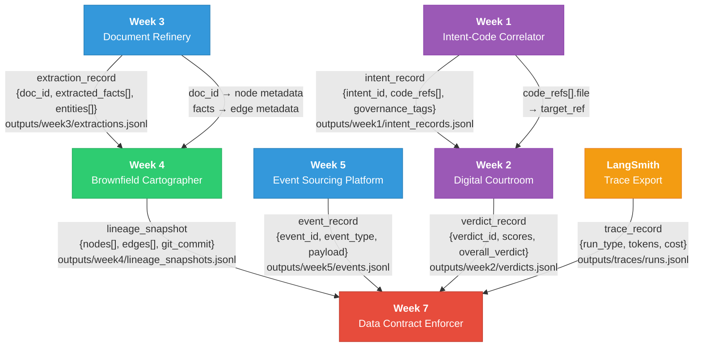
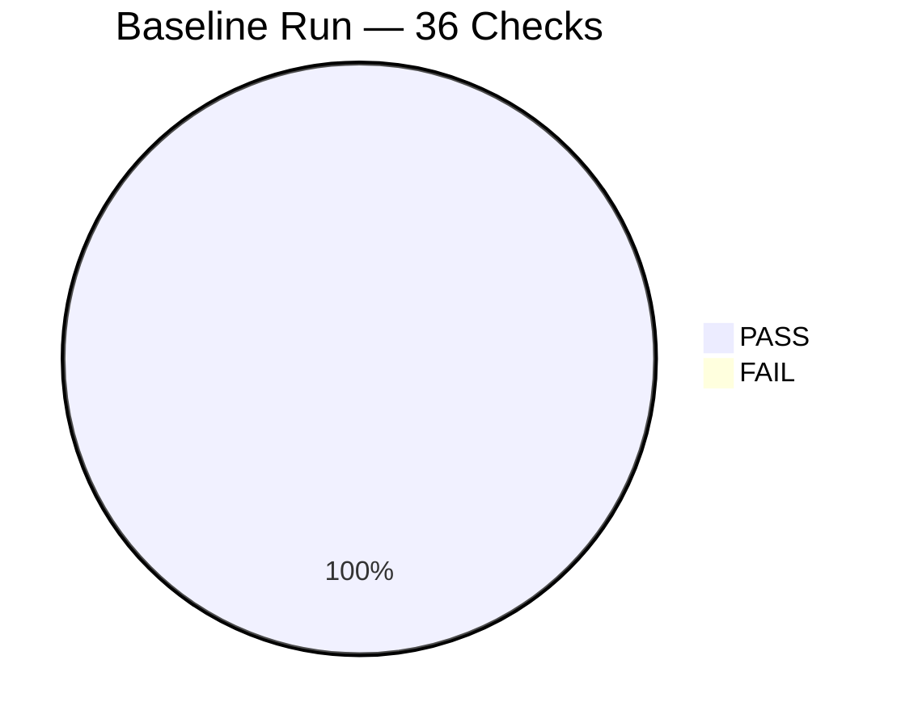
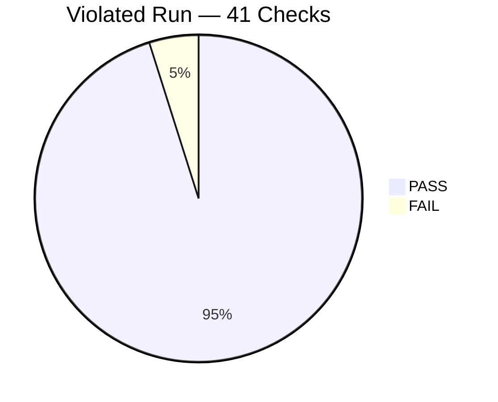

# Data Contract Enforcer — Interim Submission Report

**Week 7 Challenge | TRP1**
**Date:** April 1, 2026

---

## 1. Data Flow Diagram

The diagram below shows all five systems and their inter-system data dependencies. Each arrow is annotated with the schema it carries and the JSONL file path.

**Legend:**
- 🔴 Red = This week's system (Data Contract Enforcer)
- 🔵 Blue = Required contract targets (Week 3 + Week 5)
- 🟢 Green = Required dependency (Week 4 lineage graph)
- 🟣 Purple = Supporting systems
- 🟡 Yellow = External system

---

## 2. Contract Coverage Table

| Interface | Producer → Consumer | Schema | Contract Written? | Notes |
|---|---|---|---|---|
| Week 1 → Week 2 | Intent Correlator → Digital Courtroom | `intent_record.code_refs[]` → `verdict.target_ref` | **No** | Lower priority; no direct data failures observed |
| Week 2 → Week 7 | Digital Courtroom → AI Extensions | `verdict_record` | **Partial** | Verdict records used for LLM output schema validation in AI extensions |
| Week 3 → Week 4 | Document Refinery → Cartographer | `extraction_record` → node metadata | **Yes** | `week3_extractions.yaml` — 18 clauses, full structural + statistical |
| Week 4 → Week 7 | Cartographer → ViolationAttributor | `lineage_snapshot` | **No** | Week 4 is consumed as a dependency, not validated as a data input |
| Week 5 → Week 7 | Event Store → Contract Enforcer | `event_record` | **Yes** | `week5_events.yaml` — 14 clauses |
| LangSmith → Week 7 | LangSmith → AI Extensions | `trace_record` | **No** | Planned for final submission via `ai_extensions.py` |

**Coverage Summary:** 2 of 6 interfaces have full contracts (33%). The two highest-risk interfaces (Week 3 extractions and Week 5 events) are covered. Remaining interfaces are lower risk or planned for the final submission.

---

## 3. First Validation Run Results

### 3.1 Baseline Run (Clean Data)

Run against `outputs/week3/extractions.jsonl` (55 records) using `generated_contracts/week3_extractions.yaml`:

| Metric | Value |
|---|---|
| **Total Checks** | 36 |
| **Passed** | 36 |
| **Failed** | 0 |
| **Warned** | 0 |
| **Errored** | 0 |

All structural checks (required fields, type matching, UUID patterns, datetime formats, SHA-256 patterns) and statistical checks (range validation) passed. Baselines were established for statistical drift detection.

### 3.2 Violated Run (Injected Confidence Scale Change)

To test violation detection, we injected the canonical scale change: `confidence` was multiplied by 100 (changing from 0.0–1.0 to 0–100).

| Metric | Value |
|---|---|
| **Total Checks** | 41 |
| **Passed** | 39 |
| **Failed** | 2 |

#### Failure 1: Range Violation (CRITICAL)

| Field | Detail |
|---|---|
| **Check** | `fact_confidence.range` |
| **Severity** | CRITICAL |
| **Actual** | min=55.0, max=98.0, mean=77.25 |
| **Expected** | min≥0.0, max≤1.0 |
| **Records Failing** | 150 |

#### Failure 2: Statistical Drift (HIGH)

| Field | Detail |
|---|---|
| **Check** | `fact_confidence.statistical_drift` |
| **Severity** | HIGH |
| **Z-Score** | 623.98 |
| **Actual Mean** | 77.25 |
| **Baseline Mean** | 0.77 |
| **Baseline Stddev** | 0.12 |

The statistical drift check detected a z-score of **624 standard deviations** from baseline — unmistakably flagging the scale change even without explicit range constraints.

### 3.3 Check Distribution

---

## 4. Reflection

**What did I discover about my own systems that I did not know before writing the contracts?**

The most significant discovery was how **fragile the implicit contracts between Week 3 and Week 4 really are**. The Document Refinery produces `extracted_facts[]` with a `confidence` field that is consumed by the Cartographer as node metadata. Before writing the contract, I assumed this interface was safe because "it's just a float." Writing the contract forced me to articulate *what range* that float should occupy, *what happens* when it doesn't, and *who* downstream depends on it.

The confidence scale change from 0.0–1.0 to 0–100 is the perfect example of a **structurally valid but semantically broken** change. The data type doesn't change. The column isn't removed. No exception is thrown. The data just... means something different. And every downstream consumer silently produces wrong answers.

The second surprise was how **undocumented my enum values were**. The Week 3 `entity.type` field accepts `{PERSON, ORG, LOCATION, DATE, AMOUNT, OTHER}`, but this was never written down anywhere — it was embedded in the extraction prompt. If someone changed the prompt to include a new entity type like `CONCEPT`, every consumer that switches on entity type would silently drop those records into a default case.

The contract generation process itself was revealing: profiling the data showed that my `page_ref` field has a 25% null rate, which I hadn't noticed. This means any downstream logic that assumes `page_ref` is always present would fail on a quarter of records.

**What assumption turned out to be wrong?** I assumed that if data is structurally valid (correct types, no nulls in required fields), it is semantically valid. The 0.0–1.0 → 0–100 scenario proves this wrong. Statistical baselines — not just structural checks — are essential for catching silent corruption.
